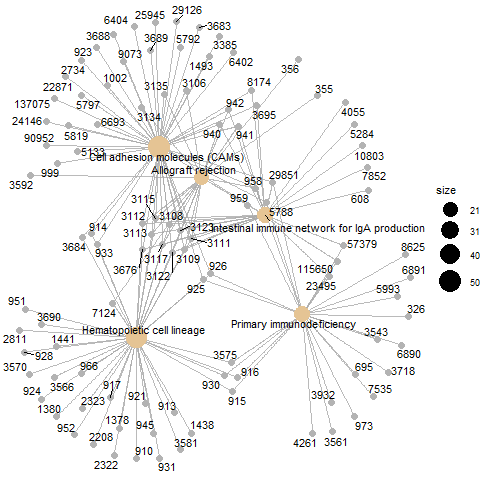
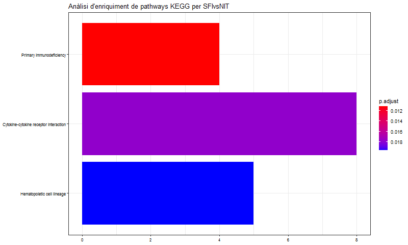
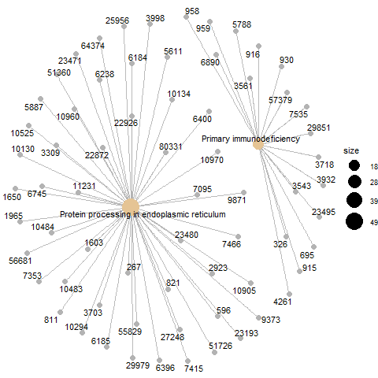

```{r setup, include=FALSE}
knitr::opts_chunk$set(echo = FALSE, message = FALSE)
```


#### Enllaç al repositori de GitHub associat a la PAC: <https://github.com/onualart/tiroides.git>

***	

## CONTINGUTS

* **[1. Abstract](#abstract)**
* **[2. Objectius](#objectius)**
* **[3. Materials i mètodes](#materials-i-mètodes)**  
    + **[3.1. Disseny de l'experiment](#disseny-de-lexperiment)**
    + **[3.2. Software utilitzat](#software-utilitzat)**
    + **[3.3. Procediment d'anàlisi de les dades](#procediment-danàlisi-de-les-dades)**  
        - **[3.3.1. Preparació de les dades](#preparació-de-les-dades)**
        - **[3.3.2. Control de qualitat, filtratge i visualització preliminar de les dades](#control-de-qualitat-filtratge-i-visualització-preliminar-de-les-dades)**
        - **[3.3.3. Normalització](#normalització)**
        - **[3.3.4. Anàlisi d'expressió diferencial](#anàlisi-dexpressió-diferencial)**
        - **[3.3.5. Anotació dels resultats](#anotació-dels-resultats)**
        - **[3.3.6. Comparació entre comparacions](#comparació-entre-comparacions)**
        - **[3.3.7. Anàlisi de significació biològica](#anàlisi-de-significació-biològica)**
* **[4. Resultats](#resultats)**
* **[5. Discussió](#discussió)**
* **[Referències](#referències)**


\newpage

## 1. Abstract

El projecte Genotype-Tissue Expression [@1] pretén crear una gran base de dades pública amb informació de l'expressió i regulació gènica en 54 teixits, obtinguda de gairebé 1000 individus, i inclou dades de RNA-seq.

En aquesta anàlisi, partim d'una selecció aleatòria de dades de RNA-seq de mostres de tiroides del projecte GTEx, tant de teixit sa com de teixit parcialment i extensament infiltrat, per buscar gens diferencialment expressatas i patrons biològicament significatius.


## 2. Objectius

- Detectar gens que s'expressen diferencialment entre els grups de teixits.

- A partir d'aquests llistats de gens diferencialment expressats, identificar *pathways* alterats en les comparacions.

Aquesta informació pot aportar coneixements sobre els processos subjacents a la infiltració linfoide de la tiroides, i pot ajudar a identificar potencials dianes terapèutiques.


## 3. Materials i mètodes

###     3.1. Disseny de l'experiment

Disposem de les dades corresponents a un total de 296 mostres de teixit de tiroides, obtingudes del projecte GTEx, de les quals:

- 236 corresponen a teixit no infiltrat (NIT)

- 42 corresponen a teixits amb petits infiltrats focals (SFI)

- 14 corresponen a teixit amb infiltrats limfoides extensos (ELI).

Les mostres pertanyen tant a homes com a dones i les dades inclouen el paràmetre del sexe.

Seleccionarem aleatòriament 10 mostres de cada grup, i a partir d'aquests subconjunts farem l'anàlisi d'expressió diferencial utilitzant un model lineal binomial negatiu, tal com està implementat al paquet *DESeq2*. Aquesta anàlisi inclourà les tres comparacions possibles entre els tres grups de teixits.


###     3.2. Software utilitzat

Per fer aquesta anàlisi s'ha utilitzat R v3.6.3 (2020-02-29) amb Bioconductor v3.10. Els paquets utilitzats inclouen:

- DESeq2 v1.26.0
- org.Hs.eg.db v3.10.0
- clusterProfiler v3.14.3


###     3.3. Procediment d'anàlisi de les dades

El procediment detallat amb tot el codi de R utilitzat, juntament amb l'*output* dels fragments de codi, es pot trobar a l'arxiu "pipeline.pdf" al repositori de GitHub. El codi pressuposa tenir instal·lats els paquets necessaris.


###        3.3.1. Preparació de les dades

Per que el procés de preparació de les dades quedi reflectit amb detall, s'inclou a l'informe el codi utilitzat en aquest punt.

Partim de dos arxius csv, un d'ells amb la taula de *counts*, amb les mostres com a columnes i els gens com a files, i l'altre amb la taula *targets*, que conté informació sobre les mostres.

El primer que fem és carregar els arxius *targets* i *counts* com a *data frames* (que anomenem *targets_big* i *counts_big*). Corregim el nom amb què estan etiquetades les mostres a *targets_big* per que el format es correspongui amb el dels noms que apareixen a *counts_big*. (Ja que d'entrada, el que a *targets_big* apareix com a guions, a *counts_big* són punts.) 

```{r, echo=TRUE}
targets_big <- read.csv2("./data/targets.csv", header = TRUE, sep = ",")

counts_big <- read.csv2("./data/counts.csv", header = TRUE, sep = ";")

library(stringr)

sample_names <- targets_big$Sample_Name
sample_names <- str_replace_all(sample_names, "-", ".")
targets_big$Sample_Name <- sample_names
```


Un cop tenim els dos *data frames*, fem la selecció aleatòria de les 10 mostres de cada grup que necessitem per a l'anàlisi.

Primer establim la "llavor" que ens permetrà fer reproduïble la selecció pseudoaleatòria amb la funció *set.seed*.

```{r, echo=TRUE}
set.seed(123)
```


Després utilitzem la funció *sample* del paquet *dplyr* per seleccionar els números de fila dintre del *data frame* *targets_big* corresponents a deu mostres a l'atzar del grup "NIT", a deu del grup "SFI" i a deu del grup "ELI". Aquests números de fila els posem en un vector.

```{r, echo=TRUE}
library(dplyr)

samplNIT <- sample(which(targets_big$Group == "NIT"), 10)
samplSFI <- sample(which(targets_big$Group == "SFI"), 10)
samplELI <- sample(which(targets_big$Group == "ELI"), 10)

samples <- c(samplNIT, samplSFI, samplELI)
```


Tot seguit creem un data frame *targets* reduït que conté només les mostres seleccionades.

```{r, echo=TRUE}
targets <- targets_big[samples,]
```


Utilitzant els noms de les mostres segons aquest *data frame* reduït, creem un data frame *counts* que contingui només les mostres seleccionades.

```{r, echo=TRUE}
columns <- targets$Sample_Name
counts <- counts_big[columns]
```


Finalment, de cara a poder fer alguns dels procediments de l'anàlisi més endavant, corregim el nom de les files i columnes de *counts*.

Del nom de les files, que correspon a l'identificador Ensembl dels gens, n'eliminem el número de versió de la part final, deixant només l'identificador en sí.

El nom de les columnes, que és l'identificador de les mostres, el substituïm pel "ShortName", que resulta més manejable.

```{r, echo=TRUE}
X <- c()

for (i in 1:length(counts_big$X)) {
X[i] <- substring(counts_big$X[i], 1, 15)
}

row.names(counts) <- X
colnames(counts) <- targets$ShortName
```


A partir dels dos *data frames* construïm l'objecte *DESeqDataSet* que utilitzarem per fer l'anàlisi (amb la funció *DESeqDataSetFromMatrix* del paquet *DESeq2*). Al crear-lo, especifiquem els factors que volem incloure en el disseny, en aquest cas els paràmetres *sex* i *Group*. Després, amb la funció *factor* especifiquem que volem incloure al disseny els tres nivells del factor *Group*, i que "NIT" és el nivell de referència.

```{r, echo=TRUE}
library(DESeq2)

dds <- DESeqDataSetFromMatrix(countData = counts,
                              colData = targets,
                              design = ~ sex + Group)
dds$Group <- factor(dds$Group, levels = c("NIT","SFI", "ELI"))
dds
```


###        3.3.2. Control de qualitat, filtratge i visualització preliminar de les dades

Per fer els primers gràfics del control de qualitat partirem de les dades del *data frame counts*.

Primer transformem les dades en *pseudocounts* utilitzant la fórmula $y = log_{2}(K+1)$. Això ens permetrà visualitzar millor les possibles diferències entre mostres, ja que les dades crues queden massa compactades al ser representades en gràfics.

```{r}
pseudoCounts <- log2(counts + 1)
```

\newpage

Generem un boxplot per comparar els *pseudocounts* entre mostres.

```{r}
library(reshape2)
library(ggplot2)
df <- melt(pseudoCounts, variable.name = "Samples")
df$Grup <- c(rep("NIT", 562020), rep("SFI", 562020), rep("ELI", 562020))
ggplot(df, aes(x = Samples, y = value)) + geom_boxplot(aes(fill = factor(Grup))) + xlab("Mostra") +
ylab(expression(log[2](count + 1))) + theme(axis.text.x = element_text(angle = 65, hjust = 1.2, vjust = 1.2))
```

No observem grans diferències entre les mostres. L'única que potser destaca és la mostra R55G_ELI, que té un número de *counts* inferior a la resta.

\newpage

Comparem les mostres també amb un histograma.

```{r}
ggplot(df, aes(x = value, colour = Samples)) + ylim(c(0, 0.17)) + xlim(c(0, 17)) +
geom_density(alpha = 0.2, size = 0.75)  +
theme(legend.position = "top") + xlab(expression(log[2](count + 1)))
```

De nou, trobem que en general no hi ha grans variacions entre les mostres, excepte en el cas de R55G_ELI, que en aquest gràfic sí que es veu més clarament diferenciada.

De totes maneres, amb el que podem veure en els gràfics (la distribució dels quartils i els *outliers* al *boxplot*, i la forma de la corva a l'histograma), és probable que aquesta diferència afecti de forma semblant a tots els gens, i en aquest cas quedarà en part corregit amb la normalització.

Per altra banda, es tracta d'una mostra del grup de teixit extensivament infiltrat, i per tant esperem una major variabilitat en els nivells d'expressió gènica. En aquest cas els nivells d'expressió semblen força diferents dels de la resta de mostres, però no podem descartar que la variació sigui deguda a la condició d'estudi -cosa que aportaria informació rellevant-, i per tant optarem per mantenir-la en l'anàlisi.
 
 
Per generar la resta de gràfics del control de qualitat ens convé estabilitzar la variança. Ho farem amb la funció "regularized log transformation" o *rlog* [@2], i no amb l'alternativa *vst*, ja que el temps de computació no és un problema.

Abans, però, filtrem el *DESeqDataSet* per eliminar les files amb un número total de *counts* de 0 o 1, que no ens aportarien cap informació però poden generar soroll innecessari.

El número de gens abans i després del filtratge és aquest.

```{r}
nrow(dds)

dds <- dds[ rowSums(counts(dds)) > 1, ]
nrow(dds)
```


```{r}
rld <- rlog(dds)
```

\newpage

Un cop estabilitzada la variança, podem fer una ullada a la distància entre mostres. Ho fem amb un *heatmap* que compara cada mostra amb les altres.

```{r}
sampleDists <- dist(t(assay(rld)))

library("pheatmap")
library("RColorBrewer")

sampleDistMatrix <- as.matrix(sampleDists)
rownames(sampleDistMatrix) <- paste( rld$ShortName, rld$sex, sep = " - " )
colnames(sampleDistMatrix) <- NULL
colors <- colorRampPalette( rev(brewer.pal(9, "Greens")) )(255)
pheatmap(sampleDistMatrix,
         clustering_distance_rows = sampleDists,
         clustering_distance_cols = sampleDists,
         col = colors)
```

Observem que les mostres es separen en dos grups bastant diferenciats, un d'ells incloent gairebé totes les mostres del grup ELI i algunes del grup SFI, i l'altre la resta. A part d'aquesta distinció, no hi ha cap mostra que destaqui especialment respecte a les altres.

\newpage

També mirem com es distribueixen les mostres segons l'anàlisi de components principals.

```{r}
plotPCA(rld, intgroup = c("Group", "sex"))
```
Veiem que la primera component principal explica la major part de la variabilitat (un 61%). En aquest eix, gairebé totes les mostres del grup ELI queden clarament diferenciades de les del grup NIT. Les mostres del grup SFI queden més repartides.

També s'intueix una separació entre les mostres en funció del sexe, tot i que queda bàsicament reflexada en la segona component principal, de pes molt menor (només un 6% de la variabilitat).
 
 
Un altre gràfic que podem fer per veure com s'agrupen les mostres és un heatmap de la variança dels 20 gens amb expressió més variable. Per fer-lo, de nou treballem a partir de les dades amb variança reduïda.

```{r}
library("genefilter")
topVarGenes <- head(order(rowVars(assay(rld)), decreasing = TRUE), 20)

mat  <- assay(rld)[topVarGenes, ]
mat  <- mat - rowMeans(mat)
anno <- as.data.frame(colData(rld)[, c("sex","Group")])
pheatmap(mat, annotation_col = anno, color = colorRampPalette(rev(brewer.pal(n = 9, name =
  "YlOrBr")))(100))
```

Tornem a observar que les mostres s'agrupen principalment en dos grups, un que inclou la majoria de mostres del grup ELI i algunes del grup SFI, i un altre que inclou la resta de mostres. També crida l'atenció que dintre d'aquests dos grups les mostres es separen clarament per sexe.


###        3.3.3. Normalització

Per tenir en compte les diferències sistemàtiques d'orígen tècnic entre mostres, apliquem una normalització. Aquesta consisteix en multiplicar el número de *counts* de cada mostra del nostre *DESeqDataSet* per una constant $C_{j}$ que calculem a partir de les dades de *counts* de la mateixa mostra. El tipus de normalització que apliquem variarà en funció del tipus de càlcul que fem per obtenir $C_{j}$.

En aquest cas utilitzarem el mètode *Relative Log Expression* o RLE [@3], que, partint de la mitjana geomètrica de l'expressió entre mostres, crea una "mostra de pseudo-referència" sobre la qual centrar les dades de les diferents mostres. Després de centrar les dades, busca la mitjana entre gens per a cada mostra.

Aquest mètode l'implementem amb la funció *estimateSizeFactors* del paquet *DESeq2*.


```{r}
dds <- estimateSizeFactors(dds)
```


###        3.3.4. Anàlisi d'expressió diferencial

L'anàlisi d'expressió diferencial consisteix en fer, per a cada contrast d'interès, tests de significació en un model binomial negatiu. Els paràmetres del model són desconeguts, però podem obtenir-ne una estimació.

La funció *estimateDispersions* del paquet *DESeq2* fa una estimació dels paràmetres de dispersió de les dades, a partir de la qual podrem obtenir els paràmetres del model.

* Primer fa un càlcul preliminar de la dispersió de cada gen mitjançant una estimació per màxima veosimilitud [@4].

* Després encongieix els valors acostant-los a la corva ajustada definida per aquesta mateixa estimació preliminar.

```{r}
dds <- estimateDispersions(dds)
```


Un cop estimats els paràmetres de dispersió podem passar a fer l'anàlisi d'expressió diferencial en sí. Convé recordar que al crear l'objecte *DESeqDataSet* ja hem especificat els factors que volem incloure al nostre disseny: el sexe i el grup de teixit segons el grau d'infiltració.

La funció *nbinomWaldTest* del paquet *DESeq2* fa el càlcul del test per a cada gen dintre de cada comparació, i afegeix els resultats al *DESeqDataSet* com a metadades. Aquests resultats inclouen el $Log_{2}$ del fold-change, el p-valor i el p-valor ajustat del contrast.


```{r}
dds <- nbinomWaldTest(dds)
```


Utilitzem la funció *results* per explorar els resultats dels diferents contrasts.

Mirem primer un resum dels resultats del contrast entre els grups "ELI" i "NIT".

```{r}
resELIvsNIT <- results(dds, contrast=c("Group","ELI","NIT"))

summary(resELIvsNIT)
```


També mirem alguns dels valors associats als gens que tenen un diferencial d'expressió positiu i negatiu més grans.

```{r}
resSigELIvsNIT <- subset(resELIvsNIT, padj < 0.1)
valSigELIvsNIT <- resSigELIvsNIT[c("log2FoldChange", "pvalue", "padj")]
head(valSigELIvsNIT[ order(valSigELIvsNIT$log2FoldChange, decreasing = TRUE), ], 3)
head(valSigELIvsNIT[ order(valSigELIvsNIT$log2FoldChange), ], 3)
```


Fem un MA plot del contrast. Per fer-lo, primer hem d'encongir el log2 dels fold changes amb la funció *lfcShrink*.

```{r}
shrELIvsNIT <- lfcShrink(dds, contrast=c("Group","ELI","NIT"))
plotMA(shrELIvsNIT, ylim = c(-5, 5))
```

Observem que en el teixit extensament infiltrat, respecte el no infiltrat, hi ha un major nombre de gens sobreexpressats que de gens inhibits, i aquests gens sobreexpressats mostren un major fold change i un nivell més alt de significació (un p-valor més petit).


Explorem el contrast entre els grups "SFI" i "NIT".

Resum dels resultats:

```{r}
resSFIvsNIT <- results(dds, contrast=c("Group","SFI","NIT"))

summary(resSFIvsNIT)
```


Gens amb un diferencial d'expressió positiu i negatiu més gran:

```{r}
resSigSFIvsNIT <- subset(resSFIvsNIT, padj < 0.1)
valSigSFIvsNIT <- resSigSFIvsNIT[c("log2FoldChange", "pvalue", "padj")]
head(valSigSFIvsNIT[ order(valSigSFIvsNIT$log2FoldChange, decreasing = TRUE), ], 3)
head(valSigSFIvsNIT[ order(valSigSFIvsNIT$log2FoldChange), ], 3)
```


MA plot:

```{r}
shrSFIvsNIT <- lfcShrink(dds, contrast=c("Group","SFI","NIT"))

plotMA(shrSFIvsNIT, ylim = c(-5, 5))
```


En aquest cas també trobem diferències en el mateix sentit: el grup de teixit parcialment infiltrat té més gens sobreexpressats que gens inhibits respecte el grup de teixit no infiltrat. La diferència és que el número total de gens diferencialment expressats és menor que en l'anterior comparació.


Explorem els resultats del contrast entre els grups "ELI" i "SFI".

Resum dels resultats:

```{r}
resELIvsSFI <- results(dds, contrast=c("Group","ELI","SFI"))

summary(resELIvsSFI)
```


Gens amb un diferencial d'expressió positiu i negatiu més gran:

```{r}
resSigELIvsSFI <- subset(resELIvsSFI, padj < 0.1)
valSigELIvsSFI <- resSigELIvsSFI[c("log2FoldChange", "pvalue", "padj")]
head(valSigELIvsSFI[ order(valSigELIvsSFI$log2FoldChange, decreasing = TRUE), ], 3)
head(valSigELIvsSFI[ order(valSigELIvsSFI$log2FoldChange), ], 3)
```


MA plot:

```{r}
shrELIvsSFI <- lfcShrink(dds, contrast=c("Group","ELI","SFI"))

plotMA(shrELIvsSFI, ylim = c(-5, 5))
```

En aquest contrast estem comparant un grup de mostres de teixit extensament infiltrat amb un grup de mostres de teixit parcialment infiltrat. Observem que hi ha força gens diferencialment expressats, però en aquest cas no n'hi ha gaires més de sobreexpressats que d'inhibits.


###        3.3.5. Anotació dels resultats

Per tenir més ben identificats els gens que hem detectat com a diferencialment expressats, hi associem el *gene symbol*, l'*Entrez ID* i el *gene name* corresponents. Ho fem a partir del paquet d'anotacions *org.Hs.eg.db*.

```{r}
library("org.Hs.eg.db")
library("AnnotationDbi")

resSigELIvsNIT$symbol  <- mapIds(org.Hs.eg.db, keys=row.names(resSigELIvsNIT),
                                 column="SYMBOL", keytype="ENSEMBL", multiVals="first")

resSigELIvsNIT$entrez  <- mapIds(org.Hs.eg.db, keys=row.names(resSigELIvsNIT),
                                 column="ENTREZID", keytype="ENSEMBL",
                                 multiVals="first")

resSigELIvsNIT$genename  <- mapIds(org.Hs.eg.db, keys=row.names(resSigELIvsNIT),
                                 column="GENENAME", keytype="ENSEMBL",
                                 multiVals="first")

resSigSFIvsNIT$symbol  <- mapIds(org.Hs.eg.db, keys=row.names(resSigSFIvsNIT),
                                 column="SYMBOL", keytype="ENSEMBL", multiVals="first")

resSigSFIvsNIT$entrez  <- mapIds(org.Hs.eg.db, keys=row.names(resSigSFIvsNIT),
                                 column="ENTREZID", keytype="ENSEMBL",
                                 multiVals="first")

resSigSFIvsNIT$genename  <- mapIds(org.Hs.eg.db, keys=row.names(resSigSFIvsNIT),
                                 column="GENENAME", keytype="ENSEMBL",
                                 multiVals="first")

resSigELIvsSFI$symbol  <- mapIds(org.Hs.eg.db, keys=row.names(resSigELIvsSFI),
                                 column="SYMBOL", keytype="ENSEMBL", multiVals="first")

resSigELIvsSFI$entrez  <- mapIds(org.Hs.eg.db, keys=row.names(resSigELIvsSFI),
                                 column="ENTREZID", keytype="ENSEMBL",
                                 multiVals="first")

resSigELIvsSFI$genename  <- mapIds(org.Hs.eg.db, keys=row.names(resSigELIvsSFI),
                                 column="GENENAME", keytype="ENSEMBL",
                                 multiVals="first")
```


Per conservar els llistats de gens obtinguts, els guardem en arxius csv, ordenant abans els resultats segons el p-valor ajustat.

```{r}
resOrdELIvsNIT <- resSigELIvsNIT[order(resSigELIvsNIT$padj),]
resOrdSFIvsNIT <- resSigSFIvsNIT[order(resSigSFIvsNIT$padj),]
resOrdELIvsSFI <- resSigELIvsSFI[order(resSigELIvsSFI$padj),]

dfELIvsNIT <- as.data.frame(resOrdELIvsNIT)
write.csv(dfELIvsNIT, file = "results/resultsELIvsNIT.csv")

dfSFIvsNIT <- as.data.frame(resOrdSFIvsNIT)
write.csv(dfSFIvsNIT, file = "results/resultsSFIvsNIT.csv")

dfELIvsSFI <- as.data.frame(resOrdELIvsSFI)
write.csv(dfELIvsSFI, file = "results/resultsELIvsSFI.csv")
```


###        3.3.6. Comparació entre comparacions

Podem comparar els diferents contrastos per veure quants gens diferencialment expressats tenen en comú.

En aquest cas, farem un diagrama de Venn amb els gens que mostren un $log_{2}$ *fold-change* superior a 1.

Per fer-lo, abans hem de crear una matriu que, per a cada gen que apareix diferencialment expressat en algun dels contrastos, ens digui si ho està o no en cada contrast (en mostrem aquí només la part superior).

```{r}
library(limma)

selectedELIvsNIT <- subset(dfELIvsNIT, abs(log2FoldChange) > 1)
selectedELIvsNIT <- row.names(selectedELIvsNIT)

selectedSFIvsNIT <- subset(dfSFIvsNIT, abs(log2FoldChange) > 1)
selectedSFIvsNIT <- row.names(selectedSFIvsNIT)

selectedELIvsSFI <- subset(dfELIvsSFI, abs(log2FoldChange) > 1)
selectedELIvsSFI <- row.names(selectedELIvsSFI)

selectednames <- unique(c(selectedELIvsNIT, selectedSFIvsNIT, selectedELIvsSFI))

selected <- matrix(rep(0, length(selectednames)*3), ncol = 3)
colnames(selected) <- c("ELI vs NIT", "SFI vs NIT", "ELI vs SFI")
row.names(selected) <- selectednames
        
for (i in 1:length(selectednames)) {
        if (selectednames[i] %in% selectedELIvsNIT) {
                selected[i,1] <- 1
        }
}

for (i in 1:length(selectednames)) {
        if (selectednames[i] %in% selectedSFIvsNIT) {
                selected[i,2] <- 1
        }
}

for (i in 1:length(selectednames)) {
        if (selectednames[i] %in% selectedELIvsSFI) {
                selected[i,3] <- 1
        }
}

head(selected, 10)
```


```{r}
selectedCounts <- vennCounts(selected)

vennDiagram(selectedCounts, cex=0.9)
title("Gens diferencialment expressats segons cada comparació.")
```

Suposant que els diferents graus d'infiltració en el teixit fossin una gradació contínua que es correspongués exactament amb els gens diferencialment expressats respecte el teixit sa, els gens alterats en teixits amb un grau baix d'infiltració formarien tots part del total de gens alterats en teixits més infiltrats. Això obviament no és així, però sí que hi ha una tendència a que gens alterats en teixits poc infiltrats ho estiguin també en teixits més infiltrats, com podem observar al diagrama.

Veiem doncs que la majoria dels gens diferencialment expressats en la comparació SFI vs NIT, que són relativament pocs, ho estàn també en la comparació ELI vs NIT, però que aquesta última en té molts més. Aquesta diferència en la mida dels grups fa pensar que els teixits ELI tenen un grau d'afectació força més gran que els teixits SFI. 

Pel que fa al contrast ELI vs SFI, podem interpretar la seva relació amb els altres contrastos en el mateix sentit. Una majoria dels gens que hi apareixen alterats ho fan també en el contrast ELI vs NIT, que en té força més.


###        3.3.7. Anàlisi de significació biològica

Farem l'anàlisi de significació biològica a partir de les anotacions de *pathways* de la Kyoto Encyclopedia of Genes and Genomes (KEGG, https://www.genome.jp/kegg/).

Abans de fer-la, però, hem de crear el llistat d'identificadors *Entrez* dels gens diferencialment expressats.

Al fer l'anàlisi d'expressió diferencial ja hem seleccionat els gens de cada comparació amb un p-valor ajustat que hem considerat significatiu (menor de 0,1). Per crear el llistat d'identificadors només els hem d'extreure dels *data frames* corresponents.

```{r}
selectedIDs <- list(dfELIvsNIT$entrez, dfSFIvsNIT$entrez, dfELIvsSFI$entrez)
names(selectedIDs) <- c("ELIvsNIT", "SFIvsNIT", "ELIvsSFI")
```


L'altra cosa que hem de fer abans de començar l'anàlisi de significació biològica és generar un llistat amb tots els gens humans coneguts que tenen almenys una anotació a KEGG. Ho fem amb la funció *mappedkeys* del paquet *AnnotationDbi*, a partir de les anotacions del genoma humà contingudes al paquet *org.Hs.eg.db*.


```{r}
library(AnnotationDbi)
mapped_genes <- mappedkeys(org.Hs.egPATH)
```


L'anàlisi de significació biològica consistirà en detectar, per a cada contrast, *pathways* comuns als diferents gens sobreexpressats. Ho farem utilitzant la funció *enrichKEGG* del paquet *clusterProfiler*, que fa servir tests de sobrerepresentació per generar la llista de *pathways*.  

El codi utilitzat també guarda la llista corresponent a cada comparació, que inclou l'identificador del *pathway* i algunes estadístiques associades, en un arxiu csv, i per cada llista genera un gràfic de barres i un de ret.


```{r}
library(clusterProfiler)
listOfData <- selectedIDs[1:3]
comparisonsNames <- names(listOfData)

for (i in 1:length(listOfData)){
        genesIn <- listOfData[[i]]
        comparison <- comparisonsNames[i]
        
        enrich.KEGG <- enrichKEGG(gene = genesIn,
                                  organism     = 'hsa',
                                  pvalueCutoff = 0.1,
                                  pAdjustMethod = "BH",
                                  universe = mapped_genes)

        
        if (length(rownames(enrich.KEGG@result)) != 0) {
                write.csv(as.data.frame(enrich.KEGG), 
                          file = paste0("./results/", "enrichKEGG.Results.", comparison,
                                        ".csv"),
                          row.names = FALSE)
                
                png(file=paste0("./results/","enrichKEGGBarplot.",comparison,".png"),
                    width = 800)
                print(barplot(enrich.KEGG, showCategory = 15, font.size = 8, 
                              title = paste0("Anàlisi d'enriquiment de pathways KEGG per ", comparison)))
                dev.off()
                
                png(file = paste0("./results/","enrichKEGGcnetplot.",comparison,".png"))
                print(cnetplot(enrich.KEGG, categorySize = "geneNum",
                               schowCategory = 15, vertex.label.cex = 0.75))
                dev.off()
        }
}
```


## 4. Resultats

Els resultats de l'anàlisi es poden trobar en arxius csv a la carpeta *results* del repositori.

D'una banda, hi ha tres llistats de gens diferencialment expressats, un per cada comparació, que inclouen els identificadors dels gens i les estadístiques de l'expressió diferencial.

També hi ha un llistat de *pathways* de KEGG per cada comparació, de nou amb estadístics associats.

La carpeta de resultats també inclou els gràfics que hem generat a partir dels llistats de *pathways*, que es poden veure a continuació.


```{r, fig.show='hold', fig.align="center", out.width='0.8\\linewidth', fig.cap="Gràfic de barres dels pathways per ELI vs NIT"}
library(knitr)
include_graphics("results/enrichKEGGBarplot.ELIvsNIT.png",)
```


```{r, fig.show='hold', fig.align="center", out.width='0.6\\linewidth', fig.cap="Gràfic de ret dels pathways per ELI vs NIT"}

```


```{r, fig.show='hold', fig.align="center", out.width='0.8\\linewidth', fig.cap="Gràfic de barres dels pathways per SFI vs NIT"}

```

```{r, fig.show='hold', fig.align="center", out.width='0.6\\linewidth', fig.cap="Gràfic de ret dels pathways per SFI vs NIT"}
include_graphics("results/enrichKEGGcnetplot.SFIvsNIT.png")
```

```{r, fig.show='hold', fig.align="center", out.width='0.8\\linewidth', fig.cap="Gràfic de barres dels pathways per ELI vs SFI"}
include_graphics("results/enrichKEGGBarplot.ELIvsSFI.png",)
```

```{r, fig.show='hold', fig.align="center", out.width='0.6\\linewidth', fig.cap="Gràfic de ret dels pathways per ELI vs SFI"}

```


\newpage

## 5. Discussió

De les tres comparacions, només a ELI vs NIT hem identificat un nombre important de *pathways*. En general, tots els indicadors que hem vist durant l'anàlisi apunten que aquest és el contrast amb més diferències d'expressió entre teixits, cosa d'esperar ja que compara les dades dels teixits més infiltrats amb les dels teixits no infiltrats. Entre els *pathways* que identifiquem al analitzar aquest contrast, n'hi destaquen diversos de relacionats amb processos immunes, essent el *pathway* "Immunodeficiència primària" el de menor p-valor i l'únic que es repeteix en els tres contrastos.

En el cas de SFI vs NIT, destaca el baix nombre de gens diferencialment expressats detectats, en comparació amb els altres contrastos. Això segurament s'expliqui perquè el grau d'infiltració dels teixits del grup SFI sigui força baix al costat del dels teixits del grup ELI, de manera que trobem destacats pocs dels gens que es podrien expressar diferencialment en teixit infiltrat.

El contrast ELI vs SFI detecta bastants gens, però al fer l'anàlisi de significació biològica només s'identifiquen dos *pathways*.

En general, convé tenir en compte que alguns dels gens diferencialment expressats podrien quedar per sobre del llindar de p-valor que ens hem marcat, dificultant així la detecció de patrons d'expressió. Això és especialment rellevant quan els p-valors amb què treballem són relativament alts, com és el cas del contrast SFI vs NIT. En aquest sentit, si utilitzéssim més mostres de la base de dades original segurament obtindriem resultats més sòlids i detectariem més *pathways*.

Un altre aspecte que pot haver influït en els resultats, distorsionant-los lleugerament, és el sexe dels individus dels que provenen els teixits. Com hem vist al fer l'anàlisi de components principals i el *heatmap* de la variança dels 20 gens amb expressió més variable, sembla que el sexe és un factor amb un cert pes en l'expressió diferencial dels gens. Cal tenir en compte que al fer la sel·lecció aleatòria de les mostres a partir de la base de dades original, no hem estratificat per sexe, de manera que els sexes no han quedat ben repartits entre els grups. Per exemple, només hi ha una mostra del grup de teixit lliure d'infiltracions que sigui d'una dona.


## Referències

