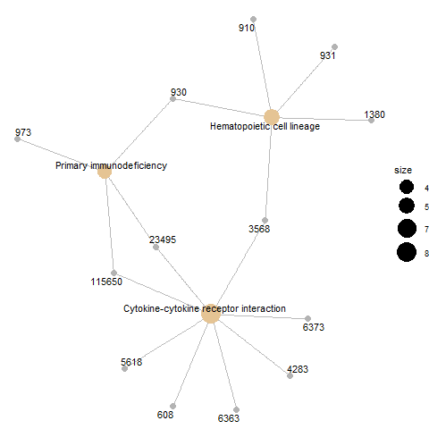

```{r setup, include=FALSE}
knitr::opts_chunk$set(echo = TRUE)
```


## CONTINGUTS
 
- **[3.3.1. Preparació de les dades](#preparació-de-les-dades)**
- **[3.3.2. Control de qualitat, filtratge i visualització preliminar de les dades](#control-de-qualitat-filtratge-i-visualització-preliminar-de-les-dades)**
- **[3.3.3. Normalització](#normalització)**
- **[3.3.4. Anàlisi d'expressió diferencial](#anàlisi-dexpressió-diferencial)**
- **[3.3.5. Anotació dels resultats](#anotació-dels-resultats)**
- **[3.3.6. Comparació entre comparacions](#comparació-entre-comparacions)**
- **[3.3.7. Anàlisi de significació biològica](#anàlisi-de-significació-biològica)**
- **[4. Resultats](#resultats)**

\newpage


### 3.3.1. Preparació de les dades

- Càrrega dels arxius *targets* i *counts* com a *data frames* i correcció del nom de les mostres de *targets_big* 

```{r}
targets_big <- read.csv2("./data/targets.csv", header = TRUE, sep = ",")

counts_big <- read.csv2("./data/counts.csv", header = TRUE, sep = ";")

library(stringr)

sample_names <- targets_big$Sample_Name
sample_names <- str_replace_all(sample_names, "-", ".")
targets_big$Sample_Name <- sample_names
```


- Llavor pseudoaleatòria

```{r}
set.seed(123)
```


- Selecció aleatòria dels números de fila de *targets_big*

```{r}
library(dplyr)

samplNIT <- sample(which(targets_big$Group == "NIT"), 10)
samplSFI <- sample(which(targets_big$Group == "SFI"), 10)
samplELI <- sample(which(targets_big$Group == "ELI"), 10)

samples <- c(samplNIT, samplSFI, samplELI)
```


- Creació del data frame *targets* reduït amb les mostres seleccionades

```{r}
targets <- targets_big[samples,]
```


- Creació del data frame *counts* reduït amb les mostres seleccionades

```{r}
columns <- targets$Sample_Name
counts <- counts_big[columns]
```


- Correcció del nom de les files i columnes de *counts*

```{r}
X <- c()

for (i in 1:length(counts_big$X)) {
X[i] <- substring(counts_big$X[i], 1, 15)
}

row.names(counts) <- X
colnames(counts) <- targets$ShortName
```


- Construcció del *DESeqDataSet*

```{r}
library(DESeq2)

dds <- DESeqDataSetFromMatrix(countData = counts,
                              colData = targets,
                              design = ~ sex + Group)
dds$Group <- factor(dds$Group, levels = c("NIT","SFI", "ELI"))
dds
```

\newpage

### 3.3.2. Control de qualitat, filtratge i visualització preliminar de les dades

- Transformació de les dades en *pseudocounts*

```{r}
pseudoCounts <- log2(counts + 1)
```


- Boxplot de comparació entre mostres

```{r}
library(reshape2)
library(ggplot2)
df <- melt(pseudoCounts, variable.name = "Samples")
df$Grup <- c(rep("NIT", 562020), rep("SFI", 562020), rep("ELI", 562020))
ggplot(df, aes(x = Samples, y = value)) + geom_boxplot(aes(fill = factor(Grup))) + xlab("Mostra") +
ylab(expression(log[2](count + 1))) + theme(axis.text.x = element_text(angle = 65, hjust = 1.2, vjust = 1.2))
```


- Histograma de comparació entre mostres

```{r}
ggplot(df, aes(x = value, colour = Samples)) + ylim(c(0, 0.17)) + xlim(c(0, 17)) +
geom_density(alpha = 0.2, size = 0.75)  +
theme(legend.position = "top") + xlab(expression(log[2](count + 1)))
```


- Filtratge de les dades

```{r}
nrow(dds)

dds <- dds[ rowSums(counts(dds)) > 1, ]
nrow(dds)
```


- Estabilització de la variança

```{r}
rld <- rlog(dds)
```


- *Heatmap* de distància entre mostres

```{r}
sampleDists <- dist(t(assay(rld)))

library("pheatmap")
library("RColorBrewer")

sampleDistMatrix <- as.matrix(sampleDists)
rownames(sampleDistMatrix) <- paste( rld$ShortName, rld$sex, sep = " - " )
colnames(sampleDistMatrix) <- NULL
colors <- colorRampPalette( rev(brewer.pal(9, "Greens")) )(255)
pheatmap(sampleDistMatrix,
         clustering_distance_rows = sampleDists,
         clustering_distance_cols = sampleDists,
         col = colors)
```

 
- Anàlisi de components principals

```{r}
plotPCA(rld, intgroup = c("Group", "sex"))
```


- Heatmap de la variança dels 20 gens amb expressió més variable

```{r}
library("genefilter")
topVarGenes <- head(order(rowVars(assay(rld)), decreasing = TRUE), 20)

mat  <- assay(rld)[topVarGenes, ]
mat  <- mat - rowMeans(mat)
anno <- as.data.frame(colData(rld)[, c("sex","Group")])
pheatmap(mat, annotation_col = anno, color = colorRampPalette(rev(brewer.pal(n = 9, name =
  "YlOrBr")))(100))
```


### 3.3.3. Normalització

- Normalització per *Relative Log Expression* 

```{r}
dds <- estimateSizeFactors(dds)
```


### 3.3.4. Anàlisi d'expressió diferencial

- Estimació dels paràmetres de dispersió de les dades

```{r}
dds <- estimateDispersions(dds)
```


- Aplicació dels tests negatius binomials

```{r}
dds <- nbinomWaldTest(dds)
```


- Resum dels resultats del contrast ELI vs NIT

```{r}
resELIvsNIT <- results(dds, contrast=c("Group","NIT","ELI"))

summary(resELIvsNIT)
```


- Valors associats als gens amb un diferencial d'expressió positiu i negatiu més gran en el contrast ELI vs NIT

```{r}
resSigELIvsNIT <- subset(resELIvsNIT, padj < 0.1)
valSigELIvsNIT <- resSigELIvsNIT[c("log2FoldChange", "pvalue", "padj")]
head(valSigELIvsNIT[ order(valSigELIvsNIT$log2FoldChange, decreasing = TRUE), ], 3)
head(valSigELIvsNIT[ order(valSigELIvsNIT$log2FoldChange), ], 3)
```


- MA plot del contrast ELI vs NIT

```{r}
shrELIvsNIT <- lfcShrink(dds, contrast=c("Group","NIT","ELI"))
plotMA(shrELIvsNIT, ylim = c(-5, 5))
```


- Resum dels resultats del contrast SFI vs NIT

```{r}
resSFIvsNIT <- results(dds, contrast=c("Group","NIT","SFI"))

summary(resSFIvsNIT)
```


- Valors associats als gens amb un diferencial d'expressió positiu i negatiu més gran en el contrast SFI vs NIT

```{r}
resSigSFIvsNIT <- subset(resSFIvsNIT, padj < 0.1)
valSigSFIvsNIT <- resSigSFIvsNIT[c("log2FoldChange", "pvalue", "padj")]
head(valSigSFIvsNIT[ order(valSigSFIvsNIT$log2FoldChange, decreasing = TRUE), ], 3)
head(valSigSFIvsNIT[ order(valSigSFIvsNIT$log2FoldChange), ], 3)
```

- MA plot del contrast SFI vs NIT

```{r}
shrSFIvsNIT <- lfcShrink(dds, contrast=c("Group","NIT","SFI"))

plotMA(shrSFIvsNIT, ylim = c(-5, 5))
```


- Resum dels resultats del contrast ELI vs SFI

```{r}
resELIvsSFI <- results(dds, contrast=c("Group","SFI","ELI"))

summary(resELIvsSFI)
```


- Valors associats als gens amb un diferencial d'expressió positiu i negatiu més gran en el contrast ELI vs SFI

```{r}
resSigELIvsSFI <- subset(resELIvsSFI, padj < 0.1)
valSigELIvsSFI <- resSigELIvsSFI[c("log2FoldChange", "pvalue", "padj")]
head(valSigELIvsSFI[ order(valSigELIvsSFI$log2FoldChange, decreasing = TRUE), ], 3)
head(valSigELIvsSFI[ order(valSigELIvsSFI$log2FoldChange), ], 3)
```


- MA plot del contrast ELI vs SFI

```{r}
shrELIvsSFI <- lfcShrink(dds, contrast=c("Group","SFI","ELI"))

plotMA(shrELIvsSFI, ylim = c(-5, 5))
```


### 3.3.5. Anotació dels resultats

- Addició del *gene symbol*, de l'*Entrez ID* i del *gene name* als llistats de gens expressats diferencialment

```{r}
library("org.Hs.eg.db")
library("AnnotationDbi")

resSigELIvsNIT$symbol  <- mapIds(org.Hs.eg.db, keys=row.names(resSigELIvsNIT),
                                 column="SYMBOL", keytype="ENSEMBL", multiVals="first")

resSigELIvsNIT$entrez  <- mapIds(org.Hs.eg.db, keys=row.names(resSigELIvsNIT),
                                 column="ENTREZID", keytype="ENSEMBL",
                                 multiVals="first")

resSigELIvsNIT$genename  <- mapIds(org.Hs.eg.db, keys=row.names(resSigELIvsNIT),
                                 column="GENENAME", keytype="ENSEMBL",
                                 multiVals="first")

resSigSFIvsNIT$symbol  <- mapIds(org.Hs.eg.db, keys=row.names(resSigSFIvsNIT),
                                 column="SYMBOL", keytype="ENSEMBL", multiVals="first")

resSigSFIvsNIT$entrez  <- mapIds(org.Hs.eg.db, keys=row.names(resSigSFIvsNIT),
                                 column="ENTREZID", keytype="ENSEMBL",
                                 multiVals="first")

resSigSFIvsNIT$genename  <- mapIds(org.Hs.eg.db, keys=row.names(resSigSFIvsNIT),
                                 column="GENENAME", keytype="ENSEMBL",
                                 multiVals="first")

resSigELIvsSFI$symbol  <- mapIds(org.Hs.eg.db, keys=row.names(resSigELIvsSFI),
                                 column="SYMBOL", keytype="ENSEMBL", multiVals="first")

resSigELIvsSFI$entrez  <- mapIds(org.Hs.eg.db, keys=row.names(resSigELIvsSFI),
                                 column="ENTREZID", keytype="ENSEMBL",
                                 multiVals="first")

resSigELIvsSFI$genename  <- mapIds(org.Hs.eg.db, keys=row.names(resSigELIvsSFI),
                                 column="GENENAME", keytype="ENSEMBL",
                                 multiVals="first")
```


- Ordenació dels resultats i conservació en arxius csv

```{r}
resOrdELIvsNIT <- resSigELIvsNIT[order(resSigELIvsNIT$padj),]
resOrdSFIvsNIT <- resSigSFIvsNIT[order(resSigSFIvsNIT$padj),]
resOrdELIvsSFI <- resSigELIvsSFI[order(resSigELIvsSFI$padj),]

dfELIvsNIT <- as.data.frame(resOrdELIvsNIT)
write.csv(dfELIvsNIT, file = "results/resultsELIvsNIT.csv")

dfSFIvsNIT <- as.data.frame(resOrdSFIvsNIT)
write.csv(dfSFIvsNIT, file = "results/resultsSFIvsNIT.csv")

dfELIvsSFI <- as.data.frame(resOrdELIvsSFI)
write.csv(dfELIvsSFI, file = "results/resultsELIvsSFI.csv")
```


### 3.3.6. Comparació entre comparacions

- Creació de la matriu necessària per fer el diagrama de Venn

```{r}
library(limma)

selectedELIvsNIT <- subset(dfELIvsNIT, abs(log2FoldChange) > 1)
selectedELIvsNIT <- row.names(selectedELIvsNIT)

selectedSFIvsNIT <- subset(dfSFIvsNIT, abs(log2FoldChange) > 1)
selectedSFIvsNIT <- row.names(selectedSFIvsNIT)

selectedELIvsSFI <- subset(dfELIvsSFI, abs(log2FoldChange) > 1)
selectedELIvsSFI <- row.names(selectedELIvsSFI)

selectednames <- unique(c(selectedELIvsNIT, selectedSFIvsNIT, selectedELIvsSFI))

selected <- matrix(rep(0, length(selectednames)*3), ncol = 3)
colnames(selected) <- c("ELI vs NIT", "SFI vs NIT", "ELI vs SFI")
row.names(selected) <- selectednames
        
for (i in 1:length(selectednames)) {
        if (selectednames[i] %in% selectedELIvsNIT) {
                selected[i,1] <- 1
        }
}

for (i in 1:length(selectednames)) {
        if (selectednames[i] %in% selectedSFIvsNIT) {
                selected[i,2] <- 1
        }
}

for (i in 1:length(selectednames)) {
        if (selectednames[i] %in% selectedELIvsSFI) {
                selected[i,3] <- 1
        }
}

head(selected, 10)
```


- Diagrama de Venn

```{r}
selectedCounts <- vennCounts(selected)

vennDiagram(selectedCounts, cex=0.9)
title("Gens diferencialment expressats segons cada comparació.")
```


### 3.3.7. Anàlisi de significació biològica

- Llistat d'identificadors *Entrez* dels gens

```{r}
selectedIDs <- list(dfELIvsNIT$entrez, dfSFIvsNIT$entrez, dfELIvsSFI$entrez)
names(selectedIDs) <- c("ELIvsNIT", "SFIvsNIT", "ELIvsSFI")
```


- Generació del llistat de gens humans coneguts a partir de les anotacions del paquet *org.Hs.eg.db*


```{r}
library(AnnotationDbi)
mapped_genes <- mappedkeys(org.Hs.egPATH)
```


- Identificació de *pathways* i generació dels arxius de resultats i dels gràfics

```{r}
library(clusterProfiler)
listOfData <- selectedIDs[1:3]
comparisonsNames <- names(listOfData)

for (i in 1:length(listOfData)){
        genesIn <- listOfData[[i]]
        comparison <- comparisonsNames[i]
        
        enrich.KEGG <- enrichKEGG(gene = genesIn,
                                  organism     = 'hsa',
                                  pvalueCutoff = 0.1,
                                  pAdjustMethod = "BH",
                                  universe = mapped_genes)

        
        if (length(rownames(enrich.KEGG@result)) != 0) {
                write.csv(as.data.frame(enrich.KEGG), 
                          file = paste0("./results/", "enrichKEGG.Results.", comparison,
                                        ".csv"),
                          row.names = FALSE)
                
                png(file=paste0("./results/","enrichKEGGBarplot.",comparison,".png"),
                    width = 800)
                print(barplot(enrich.KEGG, showCategory = 15, font.size = 8, 
                              title = paste0("Anàlisi d'enriquiment de pathways KEGG per ", comparison)))
                dev.off()
                
                png(file = paste0("./results/","enrichKEGGcnetplot.",comparison,".png"))
                print(cnetplot(enrich.KEGG, categorySize = "geneNum",
                               schowCategory = 15, vertex.label.cex = 0.75))
                dev.off()
        }
}
```


### 4. Resultats

- Imatges dels gràfics de resultats

```{r, fig.show='hold', fig.align="center", out.width='0.7\\linewidth', fig.cap="Gràfic de barres dels pathways per ELI vs NIT"}
library(knitr)
include_graphics("results/enrichKEGGBarplot.ELIvsNIT.png",)
```


```{r, fig.show='hold', fig.align="center", out.width='0.7\\linewidth', fig.cap="Gràfic de ret dels pathways per ELI vs NIT"}
include_graphics("results/enrichKEGGcnetplot.ELIvsNIT.png")
```


```{r, fig.show='hold', fig.align="center", out.width='0.7\\linewidth', fig.cap="Gràfic de barres dels pathways per SFI vs NIT"}
include_graphics("results/enrichKEGGBarplot.SFIvsNIT.png")
```

```{r, fig.show='hold', fig.align="center", out.width='0.7\\linewidth', fig.cap="Gràfic de ret dels pathways per SFI vs NIT"}

```

```{r, fig.show='hold', fig.align="center", out.width='0.7\\linewidth', fig.cap="Gràfic de barres dels pathways per ELI vs SFI"}
include_graphics("results/enrichKEGGBarplot.ELIvsSFI.png",)
```

```{r, fig.show='hold', fig.align="center", out.width='0.7\\linewidth', fig.cap="Gràfic de ret dels pathways per ELI vs SFI"}
include_graphics("results/enrichKEGGcnetplot.ELIvsSFI.png")
```


